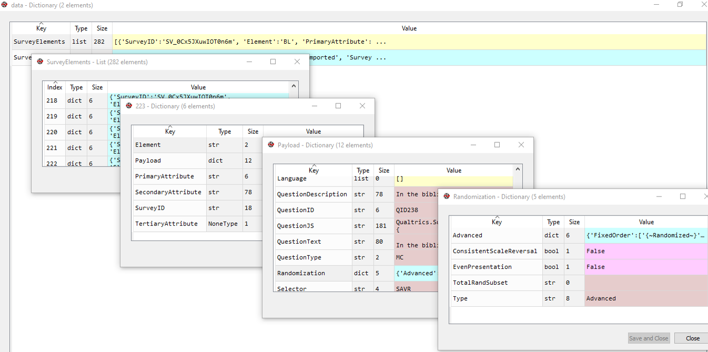
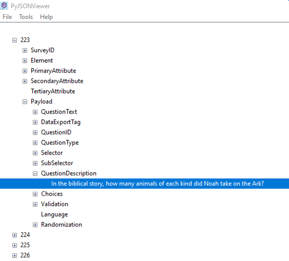

# How to automate experiments in Qualtrics
*Jérémie Beucler* *- October, 2021*

This Github page explains how to partially automate experiments generation on Qualtrics using `Python`. However, it does not deal with modifications of the Survey flow, which is easily editable manually.

<ins>Programming prerequisites:</ins> loops, read & write in a `.txt` or `.csv` file, regular expressions.[^1]

[^1]: Note that you may use `R` or a similar programming language instead of `Python` to achieve the same goal.

*This page would not have been created without Matthieu Raoelison, who came up with this process in the first place.*

## Introduction

Qualtrics is an online software that allows to generate surveys. However, people sometimes use it to design scientific psychology experiments, for several reasons. First, many universities already have a Qualtrics subscription. It is also [very convenient](https://researcher-help.prolific.co/hc/en-gb/articles/360009224113-Qualtrics-Integration-Guide#heading-1) to run an online experiment using Qualtrics and the participants recruitment platform [Prolific](https://www.prolific.com/). Also, thanks to the graphical interface, you do not need any programming skills to build your experiment in Qualtrics.

However, using Qualtrics to build experiment can be very unconvenient, to say the least. Although you can insert some [Javascript code](https://www.qualtrics.com/support/survey-platform/survey-module/question-options/add-javascript/) in your questions and add some logic or randomization to your experiment using the [Survey flow](https://www.qualtrics.com/support/survey-platform/survey-module/survey-flow/survey-flow-overview/), Qualtrics ultimately remains a "point and click" software.

Suppose you want to generate a psychology experiment in Qualtrics. In one trial, you may want to display a fixation cross for a given time, show a stimulus  and then record participants answers. In Qualtrics, generating this trial once is quite easy. However, your experiment may contain different conditions, each one containing several trials ... If you try to implement this on Qualtrics manually, it will take a lot of time and may lead to errors. Even worse, suppose you painfully managed to build your experiment, and you realize you wanted the fixation cross to be displayed not for two seconds, but only for one. You now have to modify each trial manually, one by one. Uh oh ...  This is the kind of task where you may want to use programming !

## General overview

Here is a brief summary of the different steps for automating experiments in Qualtrics:

1. Prepare a list of your different items (e.g., in a `.csv` file); (#one)
2. Write a program generating a `.txt` file with the complete structure of the experiment and import it on Qualtrics;(#2)
3. Fully customize one item on Qualtrics by hand and export your survey in a `.qsf` file(#3)
4. Open this file with Python, copy the configuration of the manually customized item onto the other items and import the new `.qsf` file on Qualtrics;(#4)
5. If you want to change something in your items configuration : go back to step 2 or 3, depending on the modification.(#5)

You may have noticed that this is not a fully automated process. You have to manually customize one item on Qualtrics, or to import and export the survey at its different stages. However, these operations are quite fast and easy to perform.

## <a name="one"></a>Step 1: Prepare a list of your different items

Create a `.csv` file (or any format you find suitable, as long as you can read it on `Python` afterwards) containing what is gonna change from trial to trial : questions, possible answers ...

It should look like this :


*A `.csv` file organization*

**Important : you should have a column containing the trial/item ID, in a structured way. This will be necessary to find your item in the `.qsf` file (step 4).**

*<ins>Example:</ins> if you have two conditions - Conflict (C) and No-Conflict (NC) - with 20 items in each, you can name your items : C_1, NC_1, C_2, NC_2, C_3 ...*

## <a name="2"></a>Step 2: Write a program generating a `.txt` file with the complete structure of the experiment and import it on Qualtrics

Fortunately, Qualtrics allows you to import a simple survey structure in a `.txt` file, using a specific syntax. However, the features you can implement through this file are very limited. For instance, you cannot configurate stimuli display time in it. This file will only allow you to create the "squeletton" of your survey.

Before proceeding, read the *Preparing a Simple Format TXT or DOC File* and the *Preparing an Advanced Format TXT or DOC File* sections of the following page, which explain the syntax of your `.txt` file : [How to import a survey on Qualtrics](https://www.qualtrics.com/support/survey-platform/survey-module/survey-tools/import-and-export-surveys/).


*A trial structure template*

Once you have understood how the `.txt` file works, you can generate a basic trial structure. I advise you to create one block per trial, as one trial contains several elements in Qualtrics format. Hence, for trial n°1, you will end up with block n°1 containing fixation cross n°1, question n°1 ... Then, you  only have to use a `for` loop to "fill" this structure with your different items. 

Here is an example of what this part of your code may look like. This generates simple trials, with a fixation cross and a MCQ. The "rt" elements correspond to "timers" in Qualtrics, that allow to record RT or to display an element for a given duration.

<ins>*Note:*<ins>

- *`questions_formated` is the data frame (`.csv` file) with all our items, ID, possible answers;*
- *`question_template` is a list of strings containing the structure of a typical trial;*
- *`list_of_question` is the list where we put all the trials;*

```python
# we loop through our questions df

for elt in range(len(questions_formated)) :

    # the template in itself, renewed at each iteration
    question_template = qualtrics_structure[1:]
    
    # the block ID; one block = a complete trial
    question_template[1] = "[[Block:" + questions_formated.loc[elt, 'ID_long'] + "]]"
    # the fixation cross ID
    question_template[4] = "[[ID:" + questions_formated.loc[elt, 'ID'] + "_cross]]"
    # rt fixation cross ID
    question_template[7] = "[[ID:" + questions_formated.loc[elt, 'ID'] + "_cross_rt]]"
    # question ID
    question_template[12] = "[[ID:" + questions_formated.loc[elt, 'ID'] + "_MCQ]]"
    # text of question
    question_template[13] = questions_formated.loc[elt, 'sentence']
    # first response option
    question_template[15] = questions_formated.loc[elt, 'Rep_1']
    # second response option
    question_template[16] = questions_formated.loc[elt, 'Rep_2']
    # third and four are always the same
    question_template[17] = "This question can't be answered in this form"
    question_template[18] = "Don't know"
    # rt MCQ ID
    question_template[20] = "[[ID:" + questions_formated.loc[elt, 'ID'] + "_MCQ_rt]]"

    # we append the completed template to the final list
    list_of_question.append(question_template)
```

**Important : you must add an ID to each element of your trial (e.g., block, fixation cross, question, timer ...). This will be necessary to find each part of your trial in the `.qsf` file (step 4). The block ID should be present in each sub-element ID.**

You have to write the final list in a `.txt` file. One trial should looks like this:


*Example of a complete trial in the final `.txt` file*

You then have to import this `.txt` file on Qualtrics.[^2] This is how to do it: [How to import a TXT Survey on Qualtrics](https://www.qualtrics.com/support/survey-platform/survey-module/survey-tools/import-and-export-surveys/#ImportTXTDoc).

[^2]: During the importation process, Qualtrics automatically adds the date after your block's name (e.g., "No_conflict_1_0" will become "No_conflict_1_0 - Oct 20, 2021").

## <a name="3"></a>Step 3: Fully customize one trial on Qualtrics by hand and export your survey in a `.qsf` file

Once your survey has been imported on Qualtrics, choose one of your trials (in Qualtrics, a "block"), and customize it manually. This is where you can set up the trial options using the Qualtrics interface.

For instance, you may want to display the fixation cross for only one second. This is how you would do it on Qualtrics, by modifying the timer of the fixation cross :


*Configuration of a timer in the Qualtrics interface*

For even more advanced customization, you may want to add some [JavaScript code](https://www.qualtrics.com/support/survey-platform/survey-module/question-options/add-javascript/) to the question. 

**Important: you must remember the ID of the trial (block in Qualtrics) you customized (e.g., "C_01"). This way, you will be able to access the different elements (questions in Qualtrics) by the IDs you defined in the `.txt`file (e.g., "C_01_cross" for the fixation cross).**

Then, export your survey as a `.qsf` file: [How to export a Survey as a QSF](https://www.qualtrics.com/support/survey-platform/survey-module/survey-tools/import-and-export-surveys/#ExportingaSurveyasaQSF).

## <a name="4"></a>Step 4: Open this file with Python, copy the configuration of the manually customized item onto the other items and import the new `.qsf` file on Qualtrics

### Understand the structure of the `.qsf` file

For this last stage, it is crucial that you understand what a `.qsf` file is and how it is organized.[^3]

Before proceeding, here are two ressources you should read that will explain it to you:
- [Quickstart Guide to understand the Qualtrics Survey File](https://gist.github.com/ctesta01/d4255959dace01431fb90618d1e8c241)
- [How to generate qualtrics questions](https://blog.askesis.pl/post/2019/04/qualtrics-generate.html)

[^3]: Due to Qualtrics updates, the organization of the `.qsf` file may change a little. You may thus have to slightly update your code in the future.

### Open the `.qsf` file

As you read, the file contains `JSON` code. Fortunately, you can read it using a `JSON` encoder/decoder. I used the [json library](https://docs.python.org/3/library/json.html) to do it. To read the qsf file, I just had to use the `json.load` function:

```python
# open the qsf file
with open('my_project.qsf', encoding = 'utf-8') as f:
  data = json.load(f)
```
At this point, you should be able to manually explore the file. I found the *variable explorer* of the [`Spyder` environment](https://www.spyder-ide.org/) to be very useful to explore the object. As you read, the object contains several elements. When you open it in `Python`, you end up with a series of nested lists/dictionaries. You can think of it as a drawer, with drawers in it, which themselves contain other drawers...

Here is an example of this type of structure:



*Example of the `.qsf` file manual exploration in the variable explorer of `Spyder`*

If you look at each window's title bar, you can see that I first opened `Data` (dict), then `SurveyElements` (list), then the item n° `223` (dict), then its `Payload` (dict), and finally its `Randomization` settings (dict).

*<ins>Note:</ins> you can also use a `JSON`viewer to explore the file. In `Python`, you can use the library `pyjsonviewer`:*

```
# view it as a tree, easier to understand the structure
pyjsonviewer.view_data(json_file="my_project.qsf")
```

Here is what it looks like:



*Example of the `.qsf` file manual exploration in `pyjsonviewer`*

Here you can see that I opened the item n°`223` in the `SurveyElements`, then its `Payload` and then its `QuestionDescription`.

### Copy-paste the customized item configuration onto the other items

Remember, you know the name of the item you customized manually. You now have to loop through your survey's elements to find it, by looking at their **`DataExportTag`, which is inside the `Payload` element and corresponds to the question ID.**

Here is a way to do it, using a `for` loop:[^4]

```python
# looping through the questions
for index in range(0, len(data['SurveyElements'])):
    # checking if question (SQ = survey questions)
    if data['SurveyElements'][index]['Element'] == "SQ":
        # checking if this is the question already formatted manually (NC_1_0 ...)
        if data['SurveyElements'][index]['Payload']['DataExportTag'] == 'NC_1_0_MCQ' :
            # printing index to look at it manually !
            print(index)
 ```

[^4]: As you read, you should only look at Survey Questions (SQ) - hence the `if data['SurveyElements'][index]['Element'] == "SQ":` line
    
This code displays the index of the multiple choice question (MCQ) element you formatted manually. You can now find it by hand in the explorer, to see which elements of the **`Payload` (which is the part of the question containing its configuration)** you may want to copy-paste onto the other questions. This should not be too difficult, as you know what you customized manually on Qualtrics and as the `Payload` elements are named transparently (e.g., `QuestionJS` for the `JavaScript` elements of the question).

Once you have done that, you simply have to do a copy-paste operation. Here is an example for multiple-choice questions (MCQs) settings:

 ```python
# this code copies the configuration of the question 'NC_1_0_MCQ' and
# applies to all the other MCQ questions of the survey

# looping through the questions
for index in range(0, len(data['SurveyElements'])):
    # checking if question (SQ = survey questions)
    if data['SurveyElements'][index]['Element'] == "SQ":
        # checking if this is the question already formatted manually (NC_1_0 ...)
        if data['SurveyElements'][index]['Payload']['DataExportTag'] == 'NC_1_0_MCQ' :
            # saving the configuration to paste it in other items !
            # choice randomization
            ref_MCQ_rando = data['SurveyElements'][index]['Payload']['Randomization']
            # validation (e.g., forced answer)
            ref_MCQ_vali = data['SurveyElements'][index]['Payload']['Validation']
            # JS for not displaying next button, going to next question when clicking
            ref_MCQ_JS = data['SurveyElements'][index]['Payload']['QuestionJS']
            
# now, I apply those parameters to other MCQ questions

# looping through the questions
for index in range(0, len(data['SurveyElements'])):
    # checking if question (SQ = survey questions)
    if data['SurveyElements'][index]['Element'] == "SQ":
        # checking if this is a MCQ question
        if re.search("MCQ$", data['SurveyElements'][index]['Payload']['DataExportTag']):
            # copy pasting the formatted configuration in the other items
            data['SurveyElements'][index]['Payload']['Randomization'] = ref_MCQ_rando
            data['SurveyElements'][index]['Payload']['Validation'] = ref_MCQ_vali
            data['SurveyElements'][index]['Payload']['QuestionJS'] = ref_MCQ_JS

 ```
 
You can see that we use [regular expressions](https://docs.python.org/3/library/re.html) to navigate through the question IDs (we imported the library [`re`](https://docs.python.org/3/library/re.html)): `if re.search("MCQ$", data['SurveyElements'][index]['Payload']['DataExportTag']):`.

Here, it allows us to only modify questions with "MCQ" in their IDs (`DataExportTag`), and not other elements of the survey such as timers, for instance.
 
You have to repeat this copy-pasting operation for each element you manually modified in your trial (e.g., the fixation cross parameters, the MCQ timer parameters, etc.).

Once you are finished, you only have to write the result in a new `.qsf` file thanks to the `json.dump` function :

 ```python
 # new version of the qsf file
with open('my_project_modified.qsf.qsf', 'w') as h:
    json.dump(data, fp=h)
 ```

### Import the new `.qsf` file on Qualtrics

Finally, you have to import the new .qsf file on Qualtrics: [How to import a QSF Survey](https://www.qualtrics.com/support/survey-platform/survey-module/survey-tools/import-and-export-surveys/#ImportingASurvey).

You should find all the different trials in the same, customized format. Congratulations, you have done it! 🎉

## <a name="5"></a>Step 5: If you want to change something in your items configuration, go back to step 2 or 3

If you realize that you have some modifications to make to your trial configuration, you can go back to step 2 or 3 (depending on the modification). Note that exporting and importing the survey in the `.qsf` format will not affect the Survey Flow, or other settings you may have fixed manually.

## Final note

I hope you enjoyed reading this page, and that it will make you gain some time if you have to use Qualtrics to build experiments !

<br>

If you have any questions, you can contact me: &nbsp;&nbsp; <jeremie.beucler@gmail.com>
    
<br>

    
***
    
**"The best part of programming is the triumph of seeing the machine do something useful. \[...\] It makes the boring fun."**  &mdash; Hilary Mason

<br>
<br>
